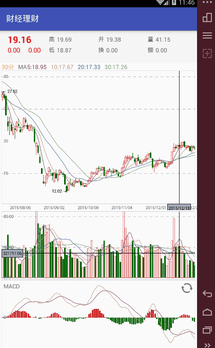

#K_线图
效果图gif



#实现横屏的核心代码是 


###步骤一: 

```
  private void drawRect(Canvas canvas) {
        canvas.drawLine(strWidth,-strWidth,strWidth,-530+2,paint);//+2是画笔的宽度
        canvas.drawLine(strWidth,-530+2,430-2,-530+2,paint);
        canvas.drawLine(430-2,-530+2,430-2,-strWidth,paint);
        canvas.drawLine(430-2,-strWidth,strWidth,-strWidth,paint);
        //这个i是高度/50 我在这写死了  同理x轴也是一样
        for(int i=0;i<10;i++){//绘制横线
            canvas.drawLine(0+strWidth,-50*i+(-strWidth),430,-50*i+(-strWidth),paint);
        }
        for(int i=1;i<8;i++){//绘制竖线
//            canvas.drawLine();
            canvas.drawLine(50*i+strWidth,0-strWidth,50*i+strWidth,-530,paint);
        }
        for(int i=0;i<11;i++){//绘制y轴方向坐标
            if(i==10){
//                canvas.drawText();
                canvas.drawText(50*i+"",0,-50*i-18,textPaint);
            }else{
                canvas.drawText(50*i+"",0,-50*i+(-25),textPaint);
            }
        }
        for(int i=1;i<9;i++){//绘制x轴方向文字
            if(i==8){
                canvas.drawText(50*i+"",50*i+8,-10,textPaint);
            }else{
                canvas.drawText(50*i+"",50*i+20,-10,textPaint);
            }
        }

    }
    {
//moveTo  moveTo 不会进行绘制，只用于移动移动画笔。
//    结合以下方法进行使用。

//lineTo lineTo 用于进行直线绘制。
//    这个类从字面意思就可以看出它跟点有关系，是点的一个对象类。
//
//    这个类有两个属性，分别是：X坐标和y坐标。
//
//    构造函数有三个：Point（），Point（int x，int y），Point（Point p）
//
//    主要方法有：
//
//    Public void set（x，y）；重新设定一下x，y的坐标
//
//    Public final void offset(int dx,int dy);给坐标一个补偿值，值可以使正的也可以是负的。
//
//    Public final void negate();否定坐标值。
//
//    Point类和android.graphics.PointF类似，不同点是前者坐标值的类型是int型，而后者的坐标值是float型。除此之外PointF类多加了几个方法，比如：
//
//    Public final float length();返回（0，0）点到该点的距离。
//
//    Public static float length(float x,float y);返回（0，0）点到（x，y）点的距离。
    }
    public void drawPoints(List<Point> points,Canvas canvas){
        Path path = new Path();
        boolean isStartPoint = false;
        paint.setColor(Color.parseColor("#9ACD32"));
        paint.setStrokeWidth(9);
        if(points!=null){
            for(Point point:points){
                if(!isStartPoint){
                    isStartPoint = true;
                    path.moveTo(point.x+strWidth,-point.y-strWidth);
                }else{
                    path.lineTo(point.x+strWidth,-point.y-strWidth);
                }
            }
// Path类将多种复合路径（多个轮廓，如直线段、二次曲线、立方曲线）封装在其内部的几何路径。
            canvas.drawPath(path,paint);
        }
    }

    /**
     *
     * 设置点的数据
     * @param points
     */
    public void setDatas(List<Point> points){
        this.mPoints = points;
//        invalidate();
    }
```
 ###步骤二:

 在Activity中调用


