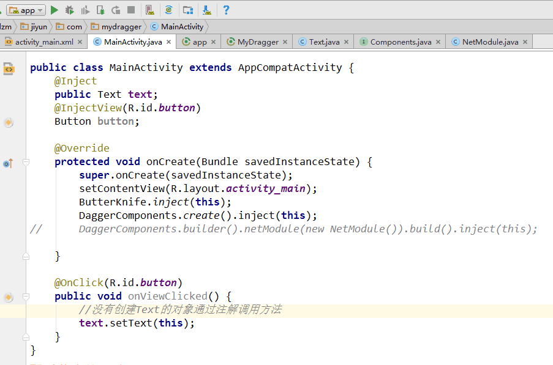

#Dagger
效果图gif

#Dagger核心是

###步骤一:
/**
     * 创建module用于创建类的实例
     */
   @Module
   public class NetModule {
       @Provides
       public Text getText(){
           return new Text();
       }
   }

###步骤二:

/**
     * 连接Activity和Moudle
     */
  @Component(modules = {NetModule.class})
  public interface Components {
      //连接MainActivity
      void inject(MainActivity mainActivity);
  }

  ###步骤二:
  /**
  *通过Inject注解调用对象的方法
  */
    @Inject
      public Text text;
      text.setText(this);

