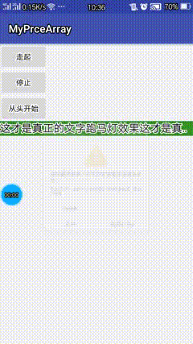

#横，竖屏 跑马灯
效果图gif

#实现横屏的核心代码是

###步骤一:

           @Override
           protected void onDraw(Canvas canvas) {

               super.onDraw(canvas);

               if (!isMeasure) {// 文字宽度只需获取一次就可以了

                   getTextWidth();

                   isMeasure = true;

               }

           }

           public void getTextWidth() {
               Paint paint = this.getPaint();

               String str = this.getText().toString();

               textWidth = (int) paint.measureText(str);
           }

           @Override
           public void run() {
               currentScrollX -= 9;// 滚动速度

               scrollTo(currentScrollX, 0);

               if (isStop) {

                   return;
               }
               if (getScrollX() <= -(this.getWidth())) {

                   scrollTo(textWidth, 0);

                   currentScrollX = textWidth;

       //   return;

               }

               postDelayed(this, 5);

           }

           // 开始滚动

           public void startScroll() {

               isStop = false;

               this.removeCallbacks(this);

               post(this);

           }

           // 停止滚动

           public void stopScroll() {

               isStop = true;

           }

           // 从头开始滚动

           public void startFor0() {

               currentScrollX = 0;
               startScroll();

           }
###步骤二:

 在Activity中调用

