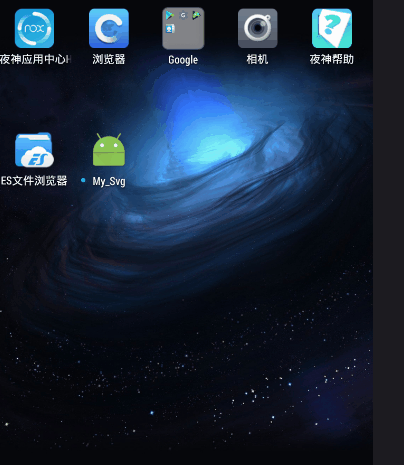

#高清图加载
效果图gif



#实现的核心代码是
1、导依赖
    ```
    compile 'com.eftimoff:android-pathview:1.0.8@aar'
    ```
2.布局
   
   ```
     xmlns:app="http://schemas.android.com/apk/res-auto"
     android:fitsSystemWindows="true"

   ```
  


3、控件
   PathView
   
   ```
   app:pathColor="@color/colorAccent"
        app:pathWidth="3dp"
        app:svg="@raw/q" //SVG图
		
    
   ```
   https://www.online-convert.com/		矢量图生成器网站

   阿里矢量图库
   http://iconfont.cn/


实现代码
1.获取控件  
  ```findViewById
  ```
2.调用代码开启svg矢量图
 ```
  pv.getPathAnimator()
                .delay(400)//几秒画一次
                .duration(4000)//画多久
                .listenerEnd(new PathView.AnimatorBuilder.ListenerEnd() {
                    @Override
                    //listenerEnd用这个方法控制此Activity跳转
                    public void onAnimationEnd() {
                        startActivity(new Intent(MainActivity.this, Main2Activity.class));
                    }
                })
                .interpolator(new AccelerateDecelerateInterpolator())
                .start();
  ```
